# Seednaut
Inspection, verification, and extraction utility for [`Seedvault`](https://github.com/seedvault-app/seedvault) backups.

<a href="https://github.com/Baltram/seednaut/actions"></a>
<a href="https://crates.io/crates/seednaut"></a>

<p>
  <a href="#quick-start">Quick Start</a> •
  <a href="#cli-examples">CLI Examples</a> •
  <a href="#build">Build</a>
</p>

---

Various Android distributions like CalyxOS, LineageOS, /e/OS and GrapheneOS integrate Seedvault as their main backup mechanism. There are currently no official tools for inspecting such backups off-device. To help fill that gap:

**Seednaut** is a desktop command-line utility that lets you

* Verify that backups are intact
* Explore backup contents before relying on them
* Recover specific files without a full device restore
* Unpack app backup data (.tar, .db) into accessible formats

It runs purely offline and supports current Seedvault app and file backup formats (namely v2 and v0, respectively). For older backups you can try some of the [`other 3rd party tools`](https://github.com/seedvault-app/seedvault#third-party-tools).



---

## Quick start

**Prerequisites:**

Seedvault backups are usually stored in a directory named `.SeedVaultAndroidBackup`. Depending on your backup configuration you can copy it

* from a phone
* from a USB drive
* from Nextcloud/WebDAV storage

Note: some file managers hide directories beginning with `.` by default.

You will also need the 12-word mnemonic phrase that was used to create the backup.

### 1. Download Seednaut

Download [`the latest release`](https://github.com/Baltram/seednaut/releases) for your operating system from the Releases page. Most users should download one of:

| Platform            | File match                  |
| ------------------- | --------------------------- |
| Linux (Intel/AMD)   | `x86_64-unknown-linux-musl` |
| Windows (64-bit)    | `x86_64-pc-windows-msvc`    |
| macOS Apple Silicon | `aarch64-apple-darwin`      |
| macOS Intel         | `x86_64-apple-darwin`       |

### 2. Run Seednaut

Running Seednaut without arguments enters an interactive mode. It guides you through the steps of locating the backup, entering your mnemonic and performing the inspection/verification/extraction.

Linux/macOS:

```bash
chmod +x ./seednaut
./seednaut
```

Windows:

```powershell
.\seednaut.exe
```
or just double click the .exe or drag&drop your backup onto it.

## CLI Examples

Seednaut can also be used directly via the following commands.

List snapshots:
```bash
seednaut list /path/to/.SeedVaultAndroidBackup
```

Inspect snapshot contents:
```bash
# All snapshots
seednaut inspect /path/to/.SeedVaultAndroidBackup

# Only specific snapshots (e.g. indices 1 and 3 from the output of the list command)
seednaut inspect /path/to/.SeedVaultAndroidBackup 1 3
```

Verify cryptographic integrity of snapshots:
```bash
seednaut verify /path/to/.SeedVaultAndroidBackup
```

Extract files:
```bash
# Basic extraction
seednaut extract /path/to/backup --out ./recovered

# Also unpack app backup data or, in case of K/V app backup, convert to JSON
seednaut extract /path/to/backup --export --out ./recovered

# Use regex to selectively extract matching package names and file paths
seednaut extract /path/to/backup --match "IMG_2026.*\.jpg$" --out ./recovered
```

Pipe mnemonic via stdin:
```bash
echo "$MY_MNEMONIC" | seednaut verify /path/to/backup
```

Run `seednaut help` or `seednaut help <command>` for full CLI documentation.

## Build

### Prerequisites
Compiling Seednaut requires Rust 1.88 or newer (via [rustup](https://rustup.rs/)) and `protoc` (the Protocol Buffers compiler):
* **Debian/Ubuntu:** `sudo apt install protobuf-compiler`
* **Arch Linux:** `sudo pacman -S protobuf`
* **macOS:** `brew install protobuf`
* **Windows:** `winget install protobuf`

### From `crates.io`

```bash
cargo install seednaut
```

### From GitHub

```bash
git clone https://github.com/Baltram/seednaut
cd seednaut
cargo build --release
```

## Development notes

AI coding tools were used during development. Generated code, architecture, crate selection were manually reviewed and iterated on extensively before release.

Please note that, while developed with security in mind, Seednaut has not undergone professional security auditing and is provided on a best-effort basis.